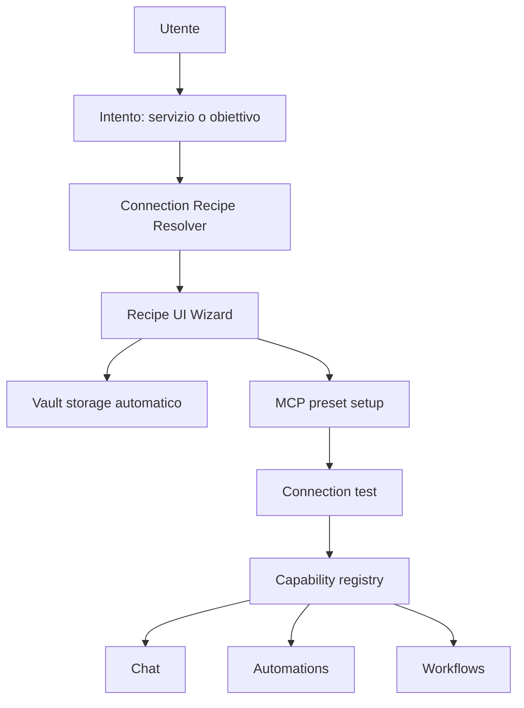

# MCP Onboarding Semplificato

## Scopo

Questo documento analizza perché la configurazione MCP resti difficile per utenti non tecnici anche quando il runtime è già valido, e propone un disegno concreto per trasformare l'esperienza da "configura un server MCP" a "collega un servizio".

L'obiettivo non è cambiare MCP come protocollo. L'obiettivo è aggiungere un layer di prodotto e UX sopra l'implementazione esistente di Homun.

## Tesi

Il problema principale non è la mancanza di supporto tecnico.

Homun ha già:

- catalogo MCP, ricerca e suggerimenti
- setup guidato da preset
- supporto Vault
- test di connessione
- helper OAuth per alcuni servizi
- install assistant che legge documentazione e spiega env vars
- runtime MCP già integrato nel registry tool

Il problema è il modello mentale esposto all'utente:

- l'utente vede ancora `server`, `transport`, `command`, `args`, `env`
- le credenziali vengono ancora presentate come variabili tecniche
- il flusso di setup parte dalla tecnologia invece che dall'obiettivo
- l'utente deve capire troppo presto cosa sia MCP

Per un utente normale, la UX corretta non è "aggiungi server MCP". La UX corretta è "collega Gmail", "collega GitHub", "usa Notion in chat", "crea un'automazione che legge il calendario".

## Stato Attuale Nella Codebase

### Runtime e configurazione

Il runtime MCP è già solido:

- `src/tools/mcp.rs` avvia i server, esegue handshake, espone i tool MCP come tool Homun e gestisce peer persistenti/stateless
- `src/mcp_setup.rs` applica preset, risolve env, salva segreti nel Vault e testa la connessione
- `src/browser/mcp_bridge.rs` mostra già il pattern giusto: nasconde dettagli MCP e sintetizza una config virtuale per Playwright

Questo è importante: la semplificazione non richiede una riscrittura del core.

### API e UI MCP

La control plane web ha già funzionalità avanzate:

- `src/web/api/mcp/catalog.rs` espone catalogo, ricerca, ranking e raccomandazioni
- `src/web/api/mcp/crud.rs` gestisce setup guidato, upsert, toggle, remove e test
- `src/web/api/mcp/install.rs` genera una guida di installazione leggendo docs e inferendo come ottenere le credenziali
- `static/js/mcp.js` implementa la pagina MCP con catalogo, connect, quick add, install assistant e helper OAuth
- `static/js/chat.js` implementa il picker MCP nella chat

Questa base è già più ricca di un semplice "form di configurazione". Il gap resta però nel linguaggio e nell'ordine delle decisioni richieste all'utente.

## Perché L'Esperienza Resta Complicata

### 1. Oggetto sbagliato esposto all'utente

L'oggetto primario della UI è il server MCP.

Per un utente tecnico questo è ragionevole. Per un utente normale è il livello sbagliato. Un utente non vuole sapere:

- se il transport è `stdio` o `http`
- se il comando è `npx`
- come sono serializzati gli args
- se il tool finale sarà `github__create_issue`

Vuole sapere:

- che servizio sta collegando
- cosa potrà fare dopo
- come autenticarsi
- se la connessione ha funzionato

### 2. Credenziali presentate troppo presto in forma tecnica

Anche con l'install assistant, il concetto centrale resta spesso:

- "compila le env vars"
- "usa `vault://...`"
- "salva e testa"

Questo è corretto come meccanica interna, ma non come esperienza primaria.

Le env vars sono un dettaglio di implementazione. L'utente dovrebbe vedere:

- nome umano del campo
- motivo per cui serve
- luogo in cui recuperarlo
- stato del campo

Non dovrebbe dover scrivere manualmente `GOOGLE_CLIENT_SECRET=...` a meno che non apra volutamente una sezione avanzata.

### 3. Flusso orientato alla configurazione, non all'intento

L'esperienza attuale parte da:

1. cerca un server
2. apri dettagli
3. compila setup
4. testa connessione

Per utenti normali il flusso migliore è:

1. dimmi cosa vuoi fare
2. ti suggerisco il servizio giusto
3. ti faccio collegare l'account
4. ti mostro cosa puoi fare ora

### 4. Output di successo troppo infrastrutturale

Messaggi come "configured and connected" sono utili ma ancora interni.

Il completamento dovrebbe comunicare capacità disponibili:

- "GitHub collegato"
- "Ora puoi leggere issue, cercare repository e creare pull request"
- "Vuoi provarlo in chat o usarlo in un'automazione?"

## Principi Di Design

La semplificazione proposta segue questi principi:

### 1. Service-first, non server-first

La UI deve presentare servizi e casi d'uso. Il server MCP resta un dettaglio tecnico.

### 2. Intent-first

L'utente può partire da:

- servizio: "collega GitHub"
- obiettivo: "voglio leggere Gmail ogni mattina"
- contesto: chat, workflow, automazione

### 3. Progressive disclosure reale

Il livello base mostra:

- servizio
- autenticazione
- capacità
- test

Il livello avanzato mostra:

- command
- args
- transport
- env raw
- mapping Vault

### 4. Forms umani, mapping tecnico automatico

L'utente compila campi semantici. Il sistema genera:

- env vars
- secret storage nel Vault
- nome server
- preset MCP finale

### 5. Connect-on-demand

Se un intento richiede un servizio non connesso, il sistema propone il collegamento nel momento giusto.

## Disegno Proposto

### Nuovo layer: Connection Recipes

Sopra i preset MCP introduciamo un nuovo layer di prodotto: `ConnectionRecipe`.

Una recipe rappresenta il modo in cui un servizio viene presentato e configurato per un utente non tecnico.

MCP rimane il backend di esecuzione. Le recipes diventano il frontend concettuale.

### Responsabilità delle recipes

Ogni recipe definisce:

- identità del servizio
- tipo di autenticazione
- campi UI umani
- mapping verso env MCP
- istruzioni user-facing
- capability disponibili dopo il collegamento
- validazione e test
- testi di successo ed error handling orientati all'utente

### Struttura dati proposta

```rust
pub struct ConnectionRecipe {
    pub id: String,
    pub display_name: String,
    pub subtitle: Option<String>,
    pub icon: Option<String>,
    pub category: String,
    pub auth_mode: ConnectionAuthMode,
    pub preset_id: String,
    pub capabilities: Vec<CapabilityDescriptor>,
    pub fields: Vec<ConnectionField>,
    pub defaults: ConnectionDefaults,
    pub success_copy: ConnectionSuccessCopy,
}

pub enum ConnectionAuthMode {
    OAuth,
    ApiKey,
    Manual,
}

pub struct ConnectionField {
    pub id: String,
    pub label: String,
    pub help: String,
    pub secret: bool,
    pub required: bool,
    pub input: ConnectionFieldInput,
    pub source_hint: Option<String>,
    pub env_map: Vec<String>,
}

pub enum ConnectionFieldInput {
    Text,
    Password,
    Url,
    Select(Vec<String>),
}

pub struct CapabilityDescriptor {
    pub id: String,
    pub label: String,
    pub description: String,
    pub example_prompts: Vec<String>,
}
```

Note importanti:

- `preset_id` riusa i preset MCP esistenti
- `env_map` permette a un campo umano di popolare una o più env vars tecniche
- `capabilities` permette di mostrare cosa l'utente guadagna subito dopo il connect

## Nuovo Modello Mentale

### Da questo

- MCP server
- command
- args
- env
- test connection

### A questo

- servizio
- collega account
- cosa puoi fare
- prova subito

## Flusso Utente Proposto

### Caso A: partenza dalla pagina "Connect Services"

1. L'utente apre "Connect Services"
2. Vede card di servizi come Gmail, GitHub, Notion, Google Calendar
3. Ogni card mostra:
   - nome
   - due o tre capability
   - livello di setup
   - pulsante `Connect`
4. Se il servizio usa OAuth:
   - il wizard chiede solo i campi che davvero servono
   - salva i segreti automaticamente nel Vault
   - esegue il test
5. Alla fine mostra:
   - stato `Connected`
   - capability disponibili
   - CTA `Try in chat`
   - CTA `Use in automation`

### Caso B: partenza da un intento in chat

1. L'utente scrive: "leggi le mie issue GitHub"
2. L'agent o la UI rileva che serve GitHub
3. Se GitHub non è collegato:
   - compare un prompt inline: `Per farlo devo collegare GitHub`
   - CTA: `Connect GitHub`
4. Completato il connect, la chat riprende l'azione iniziale

### Caso C: partenza da un'automazione

1. L'utente crea un'automazione in linguaggio naturale
2. Il builder riconosce che serve un servizio esterno
3. Prima di salvare l'automazione chiede di collegare il servizio mancante
4. Terminato il connect, ritorna al builder con la config già valida

## Architettura API Proposta

Le API esistenti possono restare. Va aggiunto un layer sopra.

### Nuovi endpoint

```text
GET  /api/v1/connections/catalog
GET  /api/v1/connections/recipes/:id
POST /api/v1/connections/recipes/:id/connect
POST /api/v1/connections/:id/test
GET  /api/v1/connections
GET  /api/v1/connections/:id/capabilities
```

### Comportamento

- `connections/catalog` espone il catalogo user-facing, non l'inventario MCP raw
- `recipes/:id` restituisce schema UI, capability, auth mode, copy e advanced settings
- `recipes/:id/connect` riceve valori umani dei campi, li mappa su env MCP, salva nel Vault e richiama l'attuale `apply_mcp_preset_setup`
- `connections/:id/test` usa il test esistente

### Riutilizzo dell'implementazione attuale

Il nuovo layer può internamente usare:

- `crate::skills::find_mcp_preset`
- `crate::mcp_setup::apply_mcp_preset_setup`
- `crate::mcp_setup::test_mcp_server_connection`
- gli helper OAuth già presenti in `src/web/api/mcp/oauth.rs`

Questo riduce drasticamente il rischio di regressioni.

## Disegno UI Concreto

### Pagina MCP attuale

La pagina attuale è ricca ma ancora centrata sul concetto tecnico di MCP.

Si propone di dividerla in due viste:

- `Connect Services`
- `Advanced MCP`

### Connect Services

Vista predefinita per utenti normali.

Elementi:

- ricerca per servizio o obiettivo
- card servizio
- badge `Easy`, `OAuth`, `Advanced`
- capability preview
- pulsante `Connect`

### Advanced MCP

Vista secondaria per utenti tecnici.

Mantiene:

- raw server list
- manual upsert
- transport
- command
- args
- env text area

In pratica l'attuale pagina MCP diventa la sezione avanzata, non la entrypoint principale.

## Esempio Di Wizard: GitHub

### Step 1

Titolo: `Connect GitHub`

Copy:

- "Usa GitHub in chat, automazioni e workflow."
- "Dopo il collegamento potrai leggere issue, repository e pull request."

### Step 2

Se possibile, usa OAuth helper già esistente.

Se non possibile:

- campo `Personal access token`
- help: "Crea un token GitHub in Settings > Developer settings > Personal access tokens"
- pulsante secondario: `Open instructions`

### Step 3

Il sistema:

- salva il token nel Vault
- costruisce `GITHUB_PERSONAL_ACCESS_TOKEN=vault://...`
- applica il preset MCP GitHub
- testa la connessione

### Step 4

Success screen:

- `GitHub connected`
- "Puoi già chiedere: Mostrami le issue aperte del repository X"
- CTA `Try in chat`
- CTA `Create automation`

## Come Ridurre La Complessità Delle Variabili D'Ambiente

Le env vars non vanno eliminate dal sistema. Vanno tolte dalla UX primaria.

### Regole

1. Ogni env var esposta all'utente deve avere un alias umano
2. Ogni segreto va salvato automaticamente nel Vault
3. L'utente non deve mai dover scrivere `vault://...`
4. Il raw editor env deve stare in "Advanced"
5. Gli errori devono essere tradotti da chiave tecnica a campo umano

### Esempio

Da questo:

- `Missing required env: GITHUB_PERSONAL_ACCESS_TOKEN`

A questo:

- `Manca il token GitHub`
- `Apri GitHub > Settings > Developer settings > Personal access tokens`

## Capability Layer

Per rendere il collegamento comprensibile e utile, ogni servizio deve dichiarare capability user-facing.

Esempio GitHub:

- `Read Issues`
- `Search Repositories`
- `Create Issue`
- `Review Pull Requests`

Esempio Gmail:

- `Read Inbox`
- `Search Mail`
- `Draft Reply`

Le capability servono a:

- spiegare il valore del collegamento
- suggerire esempi in chat
- popolare il builder di automazioni/workflow
- abilitare la UX connect-on-demand

## Disegno Del Resolver Degli Intenti

Serve un piccolo componente che colleghi richieste utente e servizi.

### Input

- testo utente
- contesto chat/workflow/automation
- lista connessioni già attive

### Output

- capability richiesta
- servizio raccomandato
- stato: disponibile o da collegare

### Esempi

- "controlla le issue" -> GitHub / `read_issues`
- "guarda le mail di oggi" -> Gmail / `read_inbox`
- "aggiungi una pagina in notion" -> Notion / `create_page`

All'inizio il resolver può essere euristico. Non serve LLM come primo passo.

## Mermaid: Architettura Proposta



## Piano Di Implementazione Pragmatico

### Fase 1: nuovo layer dati senza rompere MCP

Aggiungere un modulo, ad esempio:

- `src/connections/mod.rs`
- `src/connections/recipes.rs`
- `src/connections/resolver.rs`

Obiettivi:

- definire `ConnectionRecipe`
- mappare i preset principali già esistenti
- esporre catalogo user-facing

### Fase 2: API connect user-facing

Nuove API:

- catalog recipes
- get recipe
- connect
- test

Queste API useranno internamente gli helper MCP già esistenti.

### Fase 3: nuova vista UI "Connect Services"

Creare una vista nuova che:

- usa le recipes
- nasconde dettagli raw
- riusa helper OAuth e install assistant solo quando servono

### Fase 4: connect-on-demand in chat e automazioni

Integrare resolver e CTA inline:

- chat
- automation builder
- workflow builder

### Fase 5: capability-aware suggestions

Dopo il connect:

- suggerisci prompt di esempio
- suggerisci blocchi automazione
- suggerisci tool usage contestuale

## Scope Ridotto Consigliato

Per evitare dispersione, il primo rilascio dovrebbe coprire solo 3-5 servizi:

- GitHub
- Gmail
- Google Calendar
- Notion
- Playwright/browser come caso speciale già semplificato

Questo basta per validare il modello senza progettare un meta-sistema troppo astratto.

## Rischi E Tradeoff

### 1. Duplicazione di metadata

Parte delle informazioni oggi vive nei preset MCP e parte andrà nelle recipes.

Mitigazione:

- recipe minimale
- forte riuso dei preset esistenti
- preset come source of truth tecnica
- recipe come source of truth UX

### 2. Falsa semplicità

Alcuni servizi restano intrinsecamente complessi, specialmente con OAuth provider-specifico.

Mitigazione:

- wizard semplice
- fallback advanced esplicito
- messaggi chiari quando serve l'intervento manuale

### 3. Debito di copy e localizzazione

La qualità della semplificazione dipende molto dai testi.

Mitigazione:

- campi espliciti
- errori action-oriented
- esempi reali dopo il connect

## Decisione Raccomandata

Non investire prima in nuove astrazioni generiche del runtime MCP.

Investire invece in:

1. `ConnectionRecipe`
2. `Connect Services` UI
3. mapping automatico campi umani -> env MCP
4. capability preview
5. connect-on-demand

Questo è il punto in cui la complessità percepita per l'utente cala davvero.

## Esempio Di Mapping Concreto

```rust
ConnectionRecipe {
    id: "github".into(),
    display_name: "GitHub".into(),
    subtitle: Some("Repository, issue e pull request".into()),
    icon: Some("github".into()),
    category: "Developer".into(),
    auth_mode: ConnectionAuthMode::OAuth,
    preset_id: "github".into(),
    capabilities: vec![
        CapabilityDescriptor {
            id: "read_issues".into(),
            label: "Read Issues".into(),
            description: "Leggi issue aperte e chiuse".into(),
            example_prompts: vec![
                "Mostrami le issue aperte di owner/repo".into(),
                "Riassumi le issue più recenti".into(),
            ],
        },
    ],
    fields: vec![
        ConnectionField {
            id: "personal_access_token".into(),
            label: "GitHub token".into(),
            help: "Token personale usato per autorizzare l'accesso a repository, issue e pull request.".into(),
            secret: true,
            required: true,
            input: ConnectionFieldInput::Password,
            source_hint: Some("GitHub > Settings > Developer settings > Personal access tokens".into()),
            env_map: vec!["GITHUB_PERSONAL_ACCESS_TOKEN".into()],
        },
    ],
    defaults: ConnectionDefaults::default(),
    success_copy: ConnectionSuccessCopy {
        title: "GitHub connected".into(),
        body: "Ora puoi usare GitHub in chat, automazioni e workflow.".into(),
    },
}
```

## Conclusione

Homun ha già quasi tutto ciò che serve a livello tecnico.

Il passo mancante non è "supportare meglio MCP". Il passo mancante è trasformare MCP da concetto tecnico a infrastruttura invisibile dietro un'esperienza centrata sul servizio, sull'intento e sulle capability.

In termini pratici:

- mantenere MCP com'è sotto
- introdurre recipes sopra
- nascondere env/command/transport nel percorso standard
- far partire il collegamento dal valore per l'utente

Questa è la direzione più concreta per arrivare a un'esperienza percepita come semplice senza impoverire il sistema.
